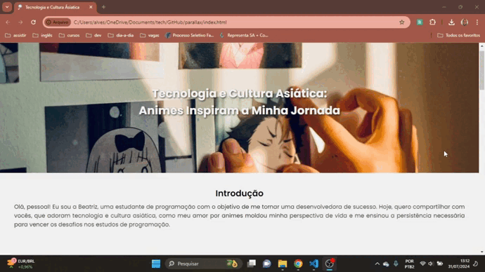

# Página Parallax 
Neste projeto, eu explorei técnicas de design responsivo para criar uma experiência de rolagem encantadora. Foi uma oportunidade divertida para aplicar e aprimorar meus conhecimentos em HTML e CSS, além de unir tecnologia e anime no conteúdo.

## Demonstração

## Tecnologias
- HTML
- CSS
- Git

## Aprendizados
Este projeto foi uma excelente oportunidade para revisar e aplicar conceitos fundamentais de HTML e CSS. Os tópicos revisados foram position (diferentes pocisionamentos em uma página), overflow (evitar que o conteúdo ultrapasse limites de container) e responsividade para adaptar o layout a diferentes tamanhos de tela, o que sem dúvida é uma das minha maiores dificuldades. Além disso, decidi utilizar a unidade de medida relativa `rem` para os tamanhos de fonte. Essa unidade se ajusta caso o usuário alterar o tamanho da fonte no navegador, ao contrário do `px`, que possui um valor absoluto e não se adapta a essas alterações.

## Link
[Converso de unidade de medida](https://nekocalc.com/px-to-rem-converter)